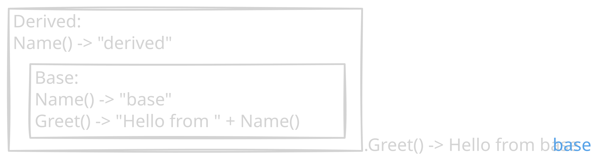

# Go Notes

## Оглавление

- [1. Введение](#1-введение)
  - [1.1. Переменные](#11-переменные)
  - [1.2. fmt.Printf](#12-fmtprintf)
  - [1.3. if, switch](#13-if-switch)
  - [1.4. for](#14-for)
  - [1.5. func](#15-func)
  - [1.6. struct](#16-struct)
  - [1.7. interface](#17-interface)
  - [1.8. generics](#18-generics)

# 1. Введение

Go быстро компилируется и исполняется. Проект на Java может компилитися целый час. Go — максимум пару секунд.

## 1.1. Переменные

Основные типы не составных переменных:

- bool
- string (interpreted read-only slice of bytes)
  - “hello\n” → “hello”
  - `hello\n` -> `hello\n`
- int, uint ← в зависимости от разрядности системы
- int8, int16, int32, int64
- uint8, …, uint64
- byte = uint8
- rune = int32 (инициализируется при помощи `x := 'A'`)
- float32, float64 (default)
- complex64, complex128 (10.9 + 13.4i)
- указатели ()
- uintptr

Объявление их происходит двумя (третий для констант) способами:

```go
username := "admin"
```

> 📌 **Note:** Возможно только внутри функций, например, внутри `func main() {...}`!

> 📌 **Note:** Если объявим при помощи этого оператора внутри другой области видимости, то создастся новая переменная!

```go
{
	x := 10
	if true {
		x := 20
		fmt.Println(x) // 20
	}
	fmt.Println(x) // 10
}
```

```go
var num int = 123123123
var name string // = "" for now
name = "John"
```

> 📌 **Note:** Есть множественное объявление!

```go
var (
  name string = "John"
  age  int    = 30
)
```

Не указываем ни тип, ни `:=`:

```go
const pi = 3.14
const full_name = first_name + " " + last_name
```

> 📌 **Note:** Значения всех констант вычисляются во время компиляции, а не выполнения!

Есть интересный механизм для констант — автоматически увеличивающаяся переменная:

```go
const (
	Monday = iota // 0
	Tuesday
	Wednesday
)
fmt.Println(Wednesday) // 2
```

> 📌 **Note:** Если просто объявить переменную и не задать ей значение сразу, то оно по умолчанию станет = 0.

Определить тип переменной можно при помощи:

```go
fmt.Printf("type(%v) = %T\n", val, val) // type(12.34) = float64
```

Go поддерживает базовую конвертацию типов:

```go
var f float64 = -3.9
var i int = int(f) // -3
var u uint = uint(f) // 0

fmt.Println(string(65))       // "A"
fmt.Println(strconv.Itoa(65)) // "65"

```

> 📌 **Note:** Однако она может вести себя по-разному в зависимости от того, что мы пытаемся сконвертировать — переменную (в runtime’е) или константу (на этапе компиляции):

```go
int(3.9) // ошибка! cannot convert 3.9 (untyped float constant) to type int
```

```go
fl := 3.9
int(fl) // 3
```

Важный нюанс касающийся именования идентификаторов: если назвать с большой буквы, то он будет доступен при экспорте модуля, если с маленькой — то недоступен! К примеру, поле класса нельзя будет посмотреть или в целом проицинилизировать эксземпляр (`p := user.Profile{Name: "John", age: 30}`). Частая проблема у новичков — пропадающие поля в JSON. Геттеры принято называть Name(), сеттеры — SetName().

Если где-то внутри if’а мы объявим переменную с таким же именем, как и вне его, то далее внутри этого же if’а мы больше не сможем получить доступ к переменной из внешней области. varName всегда будет означать “внутренняя переменная”. Такой эффект называется **shadowing**.

## 1.2. fmt.Printf

Внутри fmt.Printf можем указать placeholder, а далее его заполнить. Если не хотим выводить, а хотим лишь преобразовать строку, то используем `Sptintf()`:

```go
s1 := fmt.Sprintf("I am %v year old!", 21)
fmt.Println(s1) // I am 21 year old!
fmt.Printf("The lawyer's name is %v", "Saul Goodman.\n")
fmt.Printf("The foolowing sentence is either %v or %v.\n", true, false)
```

Основные типы:

- %v — для любых значений
- %s — для строк
- %d — для целых чисел
- %f (%.3f) — для чисел с плавающей точкой
- %t — для bool
- %q — для “” в выводе (`fmt.Printf("He said: %q.\n", "quote-quote-quote")`)
- %c — вывести символ по его коду (`fmt.Printf("%c\n", 65)` → A)
- %x — hex-представления для каждого байта чисел/строк (`fmt.Printf("%x\n", 255)` → ff)
- %+v, %#v — при выводе добавить ещё и поля (`{X:3 Y:4}`, `main.Point{X:3, Y:4}`)
- %p — вывести указатель (указывает туда же, куда и &int, для примитивных типов данных, но полезно для сложных структур):

  ```go
  	pointer_to_pt := &pt
  	fmt.Printf("%v\n", pointer_to_pt) // &{3 4}
  	fmt.Printf("%p\n", pointer_to_pt) // 0x605168c7c110
  ```

## 1.3. if, switch

Базовый синтаксис таков:

```go
if A && !B { // !B начнёт вычисляться только в том случае, если A == true!
	...
} else if C {
	...
} else {
	...
}
```

`else` должен начинаться на той же строке, что и закрывающая скобка!

Фишка Go: если переменная используется только внутри блока if, можем проинициализировать её исключительно внутри него:

```go
if weight := 10; weight > 10 {
	fmt.Println("obese")
} else {
	fmt.Println("scrawny")
}

fmt.Println(weight) // ошибка! нет такой

```

Есть switch’и. В них тоже есть локальная инициализация:

```go
switch x := 10; {
case x > 10:
	fmt.Println("big")
default:
	fmt.Println("small")
}
```

```go
switch day := "alskdjasld"; day {
case "Mon", "Tue", "Wed", "Thu", "Fri":
	fmt.Println("work day :(")
case "Sat", "Sun":
	fmt.Println("weekend day :)")
default:
	fmt.Println("unknown")
}
```

## 1.4. for

Обычное объявление цикла:

```go
for i := 0; i < 10; i++ {
	fmt.Println(i) // 0 1 2 ... 9
}
```

```go
for i := range 10 {
	fmt.Println(i) // 0 1 2 ... 9
}
```

Нет цикла while. Вместо этого можем скипать части `for`’а:

```go
i := 0
for i < 10 {
	...
	i++
}
```

```go
cond := true
for { // while true
	...
	if cond {
		break
	}
}

```

Есть встроенная итерация по различным структуркам. Важно помнить, что итератор и значение — это копии, а не ссылки. Поменяв их внутри цикла, не получим изменения оригинального объекта:

```go
nums := []int{1,2,3,4}
for i, v := range nums {
	fmt.Println("i =", i, "v =", v)
	v = 100; // бесполезно!
}
```

```go
mp := map[string][int]{"a": 1, "b": 2}
for k, v := range mp {
	fmt.Printf("k = %q, v = %v", k, v)
}
```

```go
str := "hello"
for i, r := range str {
	fmt.Printf("idx = %v, rune = %v (%c).\n", i, r, r)
}
```

Если попробуем пройтись по динамическому массиву (slice’у) через range и внутри цикла увеличить его длину, итерироваться будем по до конца старой.

Можем прерывать внешний цикл, используя label’ы:

```go
outer:
for i := range 5 {
	for j := range 5 {
		if cond {
			continue outer // skip to next i, not j!
		}
	}
}
```

## 1.5. func

Основа такая:

```go
func sum(int a, int b) int {
	return a + b
}
```

Далее можем обозначить тип нескольких переменных всего один раз (если он у них один и тот же):

```go
func sub(a, b int) int {
	return a + b
}
```

Также Go нативно поддерживает несколько возвращаемых значений, указанных через запятую:

```go
func divide(x, y float64) (float64, error) {
	if y == 0 {
		return 0, fmt.Errorf("can't divide by 0")
	}
	return x / y, nil
}
```

```go
div_res1, err1 := divide(5, 0)
div_res2, err2 := divide(8, 2)
fmt.Printf("div(%v, %v) = %v, %v\n", 5, 0, div_res1, err1) //
fmt.Printf("div(%v, %v) = %v, %v\n", 8, 2, div_res2, err2)
```

Есть интересная особенность: в маленьких функциях можно вообще не указывать, что мы возвращаем — **naked return**. Go сам подставит рядом с return то, что мы укажем возвращаемых значениях сигнатуры функции:

```go
func DoSmt(val int) (x, y int) { // не просто (int, int)
	x = val * 2
	y = val * 4
	return
}

DoSmt(10) // 20 40
```

Чтобы работать с переменным числом параметров, используется многоточие:

```go
func PrintValues(nums ...int) {
	for _, v := range nums {
		fmt.Println(v)
	}
}

PrintValues(1,2,3)
nums := []int{1, 2, 3}
Prinvalues(nums...)
```

В Go функции все функции 1-го класса. То есть с ними можно работать как с обычными переменными — передавать в качестве аргументов, присваивать переменным, возвращать и т.д:

```go
add := func(a, b int) int {
	return a + b
}
fmt.Println(add(5, 6)) // 11
```

```go
func(a, b int) {
	fmt.Println(a, b) // 5 6
}(5, 6)
```

**замыкания**

```go
func outer() func() int {
	count := 0 // внешняя переменная
	return func() int {
		count++
		return count
	}
}

out := outer()
fmt.Println(out())
fmt.Println(out())
```

Также можно закрепить определённый тип функций:

```go
type type_name func(a, b int) int
func f(another_func type_name, x int) { ... }
```

Чтобы определять метод у структуры, используется несколько иной синтаксис — перед именем добавляется указание структурки:

```go
type Person struct {
	name string
}

func (p Person) PrintName() {
	fmt.Prinln(p.name)
}
```

Большинство примитивных типов данных + кастомных структур передаются в функцию по значению, то есть просто копируются. Изменения внутри функции не приводят к изменению переданного в них объекта.

Чтобы изменения внутри функции всё-таки влияли на исходный объект, нужно передавать его по указателю:

```go
func changeValue(x *int) {
	x = 50
}

x := 10
changeValue(&x)
```

Для slice’ов/map’ов/каналов это правило не работает. В них функция копирует указатели на начало структурки данных. А так как скопировался указатель, то изменения будут проходить!

В Go есть возможность отложить несколько функций (причём исполняться они будут в обратном порядке (2, 1, close)):

```go
func readFile(filePath string) {
	f, _ := os.Open("file.txt")
	defer f.Close()
	defer func() {
		fmt.Println(1)
	}()
	defer func() {
		fmt.Println(2)
	}()
}
```

Значения переменных, которые будут использоваться внутри defer, определяются в момент определения самого defer (а не на этапе исполнения):

```go
x := 1
defer fmt.Println(x) // в конце исполнения функции напишет 1
x = 2
```

Через defer + recover используется обработка совсем лютых ошибок (panic). Если они случаются, то исполняется соответствующий блок (а выполнение всей функции прекращается):

```go
func f() err error {
	defer func() {
		if r := recover(); r != nil {
			err = fmt.Errorf("recovered: %v", r)
		}
	}()

	panic("smt broke!")

	// no further code will be executed
}
```

В функциях Go нет следующих стандартных для других языков фич:

1. `func add(a, b int = 0)` — дефолтные значения
2. перегрузок функций
3. `divide(a: 10, b: 2)` — передачи по имени

## 1.6. struct

Структурка определяется таким образом:

```go
type Person struct {
	Name string
	Age int
	IsAdmin bool
}
```

В Go нет `public`/`private`. Если назвать поле с большой буквы, оно будет доступно для других пакетов, которые будут импортировать наш. В рамках самого go-файлика (package x) поле всегда будет видно.

И далее есть 3 способа проинициализировать объект:

```go
p1 := Person{}
p2 := Person{"John", 30}
```

```go
p3 := new(Person) // type = *Person\
p3.Age = 35
```

```go
var p4 Person
p4.Age = 25
p5.IsAdmin = false
```

Также есть несколько способов сделать функцию, которая будет взаимодействовать со структуркой:

Обычные функции:

```go
func printAge(p Person) {
	fmt.Println(p.Age)
}
```

```go
func changeAge(p *Person, num int) {
	p.Age += num
}
```

Методы:

```go
func (p Person) PrintAge() {
	fmt.Println(p.Age)
}
```

```go
func (p *Person) ChangeAge(num int) {
	p.Age += num
}
```

- когда структура слишком большая (и её дорого копировать)
- когда хотим менять поля
- если хоть один из методов принимает по указателю (то все остальные лучше тоже сделать такими)

Прикольный факт: методы можно определять для любого кастомного типа данных. Но нельзя для стандартных. Поэтому можем сделать так:

```go
type Celsius float64
func (c Celsius) ToFarenheit() float64 {
	return float64(c) * 9/5 + 32
}

с := Celsius(5.6)
fmt.Printf("%v\n", c) // 5.6
fmt.Println(c.ToFarenheit()) //

```

Так как в Go нет наследования, активно используются композиция:

```go
type Person struct {
	Name string
	Age int
	IsAdmin bool
}
type Address struct {
	City, State string
}
type Employee struct {
	Person
	Address
	Role string
}

e := Employee{
	Person{"John", 30, true},
	Address{"Miami", "Florida"},
	"Admin"
}
```

Внутренняя структура вообще не имеет понятия о том, что она является частью чего-то!


У полей структур могут быть теги. К примеру, можем сказать, как следует методу encoding/json.Marshal(struct) записать каждое поле:

```go
struct Person {
	Name string     `json:"name"`
		Age int         `json:"age,omitempty"` // if = 0, will be excluded
	Email string    `json:"email"`
	Password string `json:"-"` // will be excluded
}
```

## 1.7. interface

Для реализации полиморфизма используются интерфейсы. **Интерфейс** — это просто набор методов. Чтобы структура стала связана с интерфейсом, она должна реализовать все методы с теми же сигнатурами:

```go
type Shape interface {
	Area() float64
	Perimeter() float64
}

type Rectangle struct { W, H float64 }
func (r Rectangle) Area() float64 { return r.W * r.H }
func (r Rectangle) Perimeter() float64 { return 2 * (r.W + r.H) }

type Circle struct { R float64 }
func (c Circle) Area() float64 { return math.Pi * c.R * c.R }
func (c Circle) Perimeter() { return 2 * math.Pi * c.R }

func printShapeInfo(s Shape) { fmt.Printf("area = %3.f, perimeter = %3.f\n", s.Area(), s.Perimeter()) }

rect := Rectangle{3, 4}
printShapeInfo(rect) // 12 14
circle := Circle{3}
printShapeInfo(rect) // 12 14

var rect2 Shape = Rectangle{2, 8}
```

**Частая ошибка при использовании интерфейсов**!

- если объявили метод, работающий с объектом по указателю, то мы должны создавать объекты только через указатели

  ```go
  type MyError struct { msg string }
  func (e *MyError) Error() string { return e.msg }

  var my_err Error = MyError{"some error"} // нельзя!
  var my_err Error = &MyError{"some error"} // только так!
  ```

- (если объявили обычный метод, который работает с объектом по значению, то есть копирует его, то оба вариант создания объекта подойдут)

Если у нас внутри есть структурка, в которой реализован метод, то весь объект будет удовлетворять интерфейсу.

Стоит делать интерфейсы как можно меньше. В идеале они вообще должны состоять из всего одного метода. Тогда очень много классов станут неявно их имплементировать.

К примеру, в пакете `fmt` есть интерфейс `Stringer`, состоящий из всего одного метода — `String() string`.

Стандартная функция `fmt.Println()` внутри проверяет, является ли то, что мы хотим напечатать, объектом `Stringer`. Если является, то просто выводит `obj.String()`. Поэтому мы можем сделать кастомный вывод наших структур:

```go
type Person struct {
	Name string
	Age int
}

func (p Person) String() string {
	return fmt.Sprintf("%s (%d)", p.Name, p.Age)
} // теперь отзываемся и на Stringer!

p := Person{"John", 30}
fmt.Println(p) // John (30), а не {John 30}
```

Также можно написать общий интерфейс для всего, что что-то куда-то пишет. Он уже реализован в пакете `io`:

```go
type Writer interface { Write(p []byte) (n int, err error) }
```

Тогда, если у разных структур (os.Stdout, os.File, bytes.Buffer) реализован метод `Write()`, можем использовать такой полиморфизм:

```go
func writeGreeting(w io.Writer, name string) {
	fmt.Fprintf(w, "Hello, %s!", name)
}

writeGreeting(os.Stdout, "Alice")
writeGreeting(os.Create("greet.txt"), "Bob")
writeGreeting(...)
```

Чтобы проверить тип переменной какого-то интерфейса, используем `obj.()`:

```go
var circ Shape = Circle{8}
circ.R = 10 // ошибка! у абстрактного Shape может и не быть радиуса!
if c, ok := circ.(Circle); ok {
	fmt.Println("radius:", c.R) // а теперь всё хорошо!
}
```

- `c` — новый объект, появившийся в результате попытки привести переменную circ к типу Circle. Внутри if’a используется именно он!

```go
switch shape := circ.(type) {
case Circle:
	fmt.Println("radius:", shape.R)
case Rectangle:
	fmt.Printf("W = %d, H = %d\n", shape.W, shape.H)
default:
	fmt.Println("unknown shape type")
}
```

Или крутой синтаксис (пусть `nil` имеет тип `*Rectangle`, может ли такой `nil` быть присвоен объекту класса `Shape`?):

```go
var _ Shape = (*Rectangle)(nil) // скомпилится, если есть связь, иначе выдаст ошибку
```

Часто можно увидеть, что интерфейс является составной частью структурки, чтобы избавиться от зависимости от конкретного класса (вместо неё получается зависимость от общего интерфейса):

```go
type Notifier interface { Notify(msg string) error }
type OrderService struct {
	...
	notifier Notifier // имеем общий интерфейс
}
func NewOrderService(n Notifier) *OrderService {
	return &OrderService{..., n}
}

type EmailNotifier struct {}
func (EmailNotifier) Notify (msg String) error { ... return nil }

type SMSNotifier struct {}
func (SMSNotifier) Notify (msg String) error { ... return nil }

svc1 := NewOrderSerivce(EmailNotifier{})
svc2 := NewOrderService(SMSNotifier{})
svc_t := NewOrderSerivce(FakeNotifier{})
```

Если где-то ожидается указатель на переменную общего типа (напр., error), то следует возвращать явный `nil`, а не `var x *SpecificType = nil`:

Пример плохого кода:

```go
type MyError struct{ msg string }
func (e *MyError) Error() string { return e.msg }

func doSomething(fail bool) error {
    var err *MyError // nil pointer
    if fail {
        err = &MyError{msg: "something broke"}
    }
    return err // баг!
}
```

Вроде бы, если нет никакого fail, то возвращаем указатель на nil типа *MyError. Значит, такая проверка должна сработать, но она не работает:

```go
err := doSomething(false) // не должно быть fail'а
// вроде бы, err = nil
if err != nil {
    fmt.Println("got an error!") // prints! shouldn've!
}
```

Пример хорошего кода:

```go
func doSomething(fail bool) error {
	if fail {
		return &MyError{msg: "something broke"}
	}
	return nil // явно прописали
}
```

Последний момент — интерфейсы можно объединять:

```go
type ReaderWriter interface {
	Reader
	Writer
}
```

Только объекты, имеющие и Read(), и Write(), будут ему удовлетворять.

Главное, чтобы у входящих интерфейсов не были одинаковые названия функций с разными сигнатурами:

```go
type A interface {
    Foo() int
}

type B interface {
    Foo() string
}

type C interface {
    A
    B  // compile error: duplicate method Foo with different signatures
}
```

## 1.8. generics

Раньше, чтобы определить функцию для нескольких типов, приходилось делать несколько разных функций:

```go
func SumInt(nums []int) int {
	var total int
	for _, val := range nums {
		total += val
	}
	return total
}
```

```go
numsInt := []int{1, 2, 3, 4, 5}
fmt.Println("SumInt(numsInt) =", SumInt(numsInt)) // 15
```

```go
func SumFloat(nums []float64) float64 {
	var total float64
	for _, val := range nums {
		total += val
	}
	return total
}
```

```go
numsFloat := []float64{1.1, 2.2, 3.3, 4.4, 5.5}
fmt.Println("SumFloat(numsFloat) =", SumFloat(numsFloat)) // 16.5
```

Начиная с версии 1.18, в Go появилась возможность писать общие функции:

```go
func SumNumsT int | float64 T {
	var total T
	for _, val := range nums {
		total += val
	}
	return total
}
```

```go
fmt.Println("SumNums(numsInt) =", SumNums(numsInt))
fmt.Println("SumNums(numsFloat) =", SumNums(numsFloat))

```

На самом деле, часть внутри квадратных скобок можно вынести в отдельный интерфейс:

```go
type Number interface {
	~int | int8 | int16 | ~float32 | ~float64
}
```

- или int8, или любой кастомный тип, содержащий в себе int (`type CustomInt int`), или int16, или …

```go
func SumT Number T { ... }
```

Помимо того, можно обобщать не только функции, но и структуры:

```go
type [T Number]MyStruct struct {
	items []T
}
```

Особое место — пустой интерфейс.
